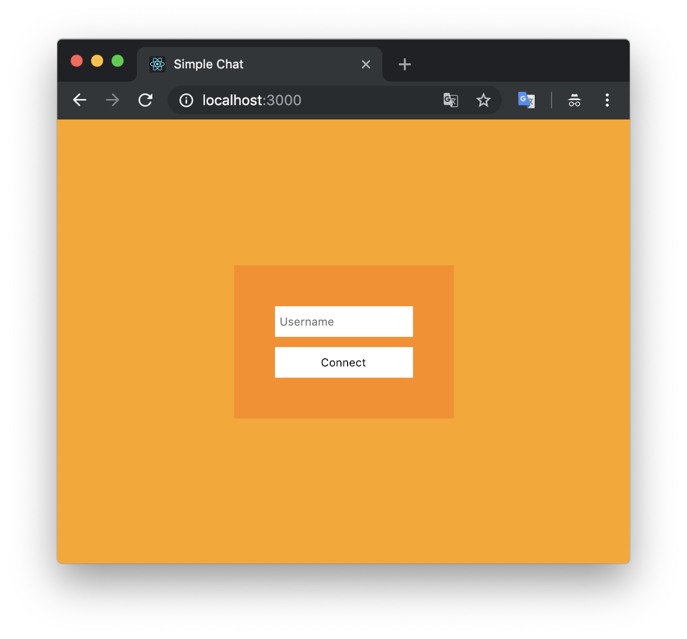
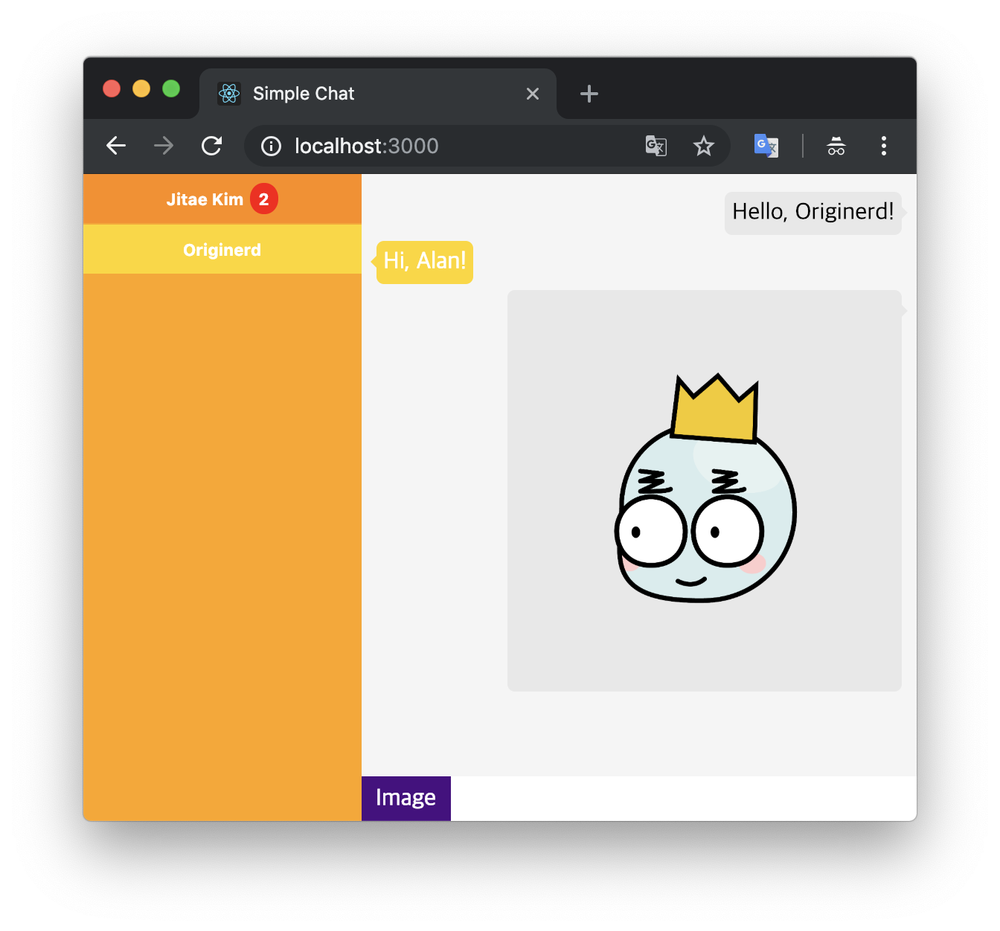

# Simple Chat

## Introduction

- It's a simple chat service.

## Execution

### Back-end

1. Go to `back` directory
1. `$ npm install`
1. `$ npm start`

### Front-end

1. Go to `front` directory
1. `$ npm install`
1. `$ npm start`

## Screenshots

1. Sign in
    
1. Chat
    
